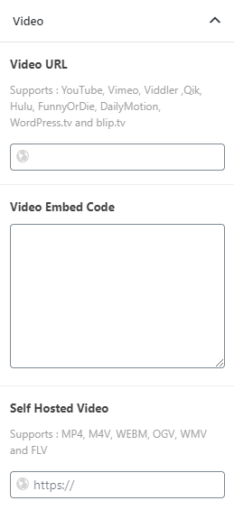
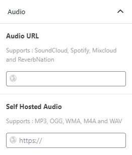

# Content Creation

## Creating Homepage

${var.theme-name} theme comes with blocks that helps you to create a unique layout for pages. First of all, You need to install the plugin **${var.theme-name} Extension** from menu `Plugins > Install Plugins`.

To create a page for using as a homepage, Please follow the below instruction.

1. Go to `Pages > Add New`.
2. Enter page title.
3. Hide page header by set the option `Layout Options > Page Header` to **None**.
4. Hide sidebar by set the option `Layout Options > Sidebar Position` to **None**.
5. Hide share buttons by set the option `Site Options > Components > Hide Post Share Buttons` to **None**.

Now the page is an empty page and ready for using gutenberg to create a homepage for your site.

#### Using Gutenberg

Gutenberg is a wordpress native editor which allow you to focussing on creating content.

1. Click add button  and choose a block you want to add. All ${var.theme-name}'s blocks is in the group **${var.theme-name}**.
2. After added, You will see the block appeared in the editor. You can change block's options at the right side of page. Each block have a different options.
7. After complete the page options, Click **Publish** button.

---

## Creating Pages

Creating pages is a simple process. Please follow this steps:

1. To start creating the pages navigate to `Pages > Add New`.
2. Enter the page title.
3. Enter the page content. You can also use a shortcode.
4. (optional) Locate **Page Options** box on the page. It contains options for customize this page.

#### Adjusting Page Layout

You can change post layout by using **Layout Options**. This options is for change layout of the current post. If you need to change the default post layout, Please go to `Appearance > Customizer > Page Settings > Layout`.

* **Page Header** – Change page header layout.
* **Media Location** – Change media location (featured image, video and audio).
* **Featured Image Size** – Change featured image size to fit the layout. You can reduce the image size to make the post loaded faster.
* **Sidebar Position** – Change sidebar location for this post.
* **Custom Sidebar** – Change sidebar for this post.

---

## Creating Posts

First thing to create blog content is to create a post post. Theme has various post options for you display different content on your blog post. Here are the steps to create a blog post.

1. Go to `WordPress Dashboard > Posts > Add New`.
2. Enter post title and content. You can use any shortcode or HTML to editing field.
3. Assign this post to category using categories box on the right side
4. Add tags to this post. Type tag name in to the field in Tags box on the right side.
5. Upload post featured image using set featured box on the bottom right side. All pages will use this image for post preview image and thumbnail.
6. Once you finish, click Publish.

#### Featured Image

While the theme can function without featured images, it's highly recommended that you add a featured image to each post. This not only makes your site/blog more lively but also improves user experience.

To set the featured image, use the WordPress normal method. Click **Set featured image** link in the **Featured Image** box and choose an image.

##### Recommended Image Size

Image size (dimensions) will depend on what type of layout you're using throughout your WordPress installation or per individual post basis. This image will not only be used on the post, but also on the category listing pages.

* Compatible with all layouts and full-width slider - **${var.minimum-image-size}** minimum (width x height). **${var.recommended-image-size}** is recommended.
* For posts that will only appears in homepage blocks and listings - **${var.post-image-size}** minimum.

##### Adding Custom Image Size

You can add a new image size or modify the existing image sizes as follows

1. Navigate to `Appearance > Customizer > Custom Image Sizes`.
2. To modify image size, Click the down arrow of the image size and change it.
3. To add new image size, Click the button `Add new image size` and enter image size information.
4. Once you finish, click Publish.

#### Post Options

You will see the following post options when adding a post.

* **Featured Post** – Mark this post as featured post.
* **Primary Category** – Select primary category.
* **Tagline** – Enter tagline. It will be displayed with title.

#### Video Format Options

After select the **Post Layout** option to **Video**, The options for video will be shown. Just enter a link to Youtube video or Vimeo video.

#### Audio Format Options

After select the **Post Layout** option to **Audio**, The options for audio will be shown. Just enter a link to Soundcloud audio.

#### Gallery Format Options

After select the **Post Layout** option to **Gallery**, The options for gallery will be shown. Just add an image into gallery. You can drag and drop for sorting order of images.

#### Adjusting Post Layout

You can change post layout by using **Layout Options**. This options is for change layout of the current post. If you need to change the default post layout, Please go to `Appearance > Customizer > Posts Settings > Layout`.

* **Page Header** – Change page header layout.
* **Media Location** – Change media location (featured image, video and audio).
* **Featured Image Size** – Change featured image size to fit the layout. You can reduce the image size to make the post loaded faster.
* **Sidebar Position** – Change sidebar location for this post.
* **Custom Sidebar** – Change sidebar for this post.

---

## Creating Reviews

To write a review in posts, Please looking for **Review Block** in Post Edit page. It contains options for writing a review.

Simply add the block **Review** and enter review information. For inputing criterion, The score is always between on 0-100. It will be converted to the selected score type by automatic. Once you finish customising review options for the post then update the post.

