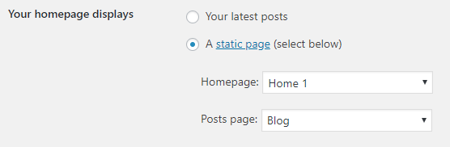
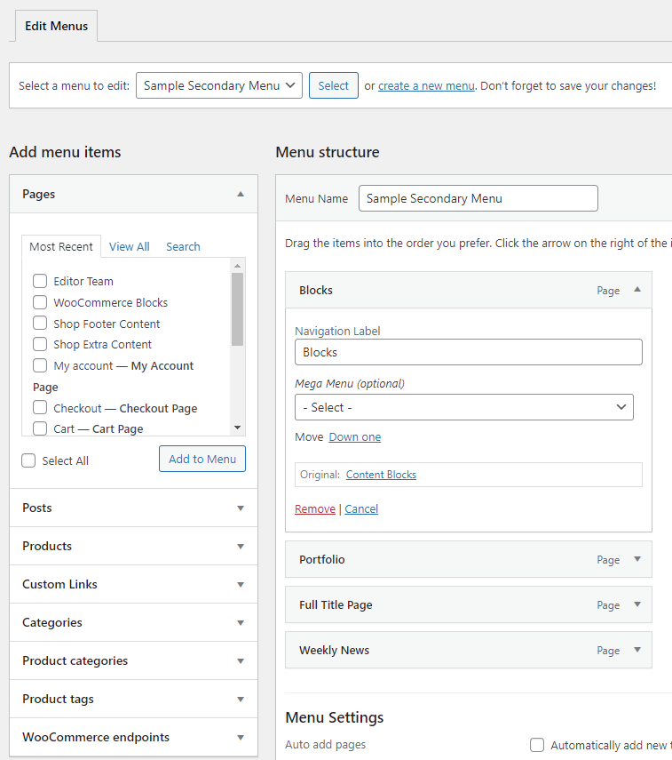
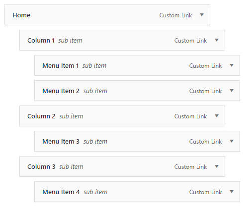
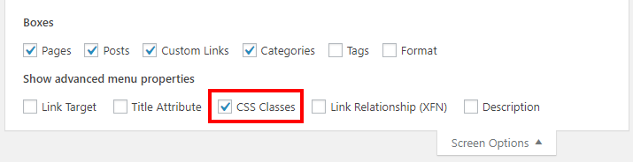

# Setup

After you've successfully uploaded and activated ${var.theme-name} theme, it is time to setup the theme.

## Importing Customizer Preset

To have the same design as demo site, You should import a customizer preset. Please follow these steps.

1. Install the <a href="https://wordpress.org/plugins/customizer-export-import/" target="_blank">Customizer Export/Import plugin</a>.
2. Download a customizer file from <a href="https://envirra.github.io/wordpress-neue/demo-classic/customizer.dat" target="_blank">this link</a>.
3. Navigate to `Appearance > Customizer > Export/Import`.
4. In case you have an existing customizer of third-party plugins, It would be great to backup it first. Click the `Export` button to download a backup file.
5. To start importing, click `Choose file` button. Select the downloaded file and click `Import`.
6. Click `Publish` button to save settings.

## Home Page

By default, Wordpress displays blog posts in the home page but we will display a static page as our home page.
1. For that we'll have to create a page and call it **Home 1**.
2. Create another Page from `Pages > Add New` and name it **Blog**.
3. Navigate to `Settings > Reading ` and choose **A static page** radio button option for **Front page displays** settings.

We'll create the contents of the Blog and Home page later.

---

## Navigation

To create a new navigation menu :

1. Navigate to `Appearance > Menus`.
2. Click on **Create a new menu**, give the menu a name.
3. Now to the left are available menu items that can be added to the screen, check the items you want to add and click on **Add to Menu** button.
4. The items are now added to Menu, you can then sort and lay the menu items in levels by drag and drop.
5. Click on **Save Menu**.
6. After you have saved the menu, hook the menu to any of the available **${var.theme-name}** Nav menu locations.

Read more about Wordpress Menus at <a href="http://codex.wordpress.org/WordPress_Menu_User_Guide" target="_blank">Wordpress Menu User Guide</a>

---

## Mega Menu

${var.theme-name} theme comes with mega menu for **Main menu**.

#### Enabling Mega Menu Options

To enable mega menu options, You need to assign menu as **Main Menu** as the following steps :

1. Navigate to `Appearance > Menus` and create a new menu (or select your existing menu).
2. At `Menu Settings > Display Location`, Select **Main Menu**.
3. Click **Save Menu**.
4. When the menu is already assigned as a Main Menu, The mega menu options will be displayed in each menu item.

#### Building Columns Mega Menu

You can show sub menu items as a columns.

1. Navigate to `Appearance > Menus` and select your main menu.
2. Add new menu item as a first level, Set the option **Mega Menu** to **Columns**.
3. To create a menu column, Add new menu item as a second level. All menu items in this level will be displayed as a column title.
4. To add a link inside each column, Please add new menu item as a third level.
5. Click **Save Menu**.

##### Hiding Column Title

1. Click **Screen Options** button at the top right of screen and select ** CSS Classes**.

2. Expand the second level menu item. Enter `hidden` into **CSS Classes** option.

3. Do the same thing for all menu items in second level.

4. Click **Save Menu**.

#### Building Posts Mega Menu

You can show posts in the menu for getting more reach.

1. Navigate to `Appearance > Menus` and select your main menu.
2. Add new menu item as the first level and set the option **Mega Menu** to **Latest Posts**.
3. The new option **Post Category** will be visible. Select the category you want to show latest posts from. Leave blank for showing latest posts from blog.
4. Click **Save Menu**.

---

## Sidebars & Widgets

The theme has 7 pre-defined sidebars which you can use below sidebars for quick start building your site

* **Primary Sidebar** - Default sidebar for pages and posts.
* **Slide Sidebar** - Default sidebar for all single posts.
* **Shop Sidebar** - Default sidebar for all shop pages.
* **Footer Sidebar 1-4** - Default sidebar for footer area.

#### Create a New Sidebar

Theme has pre-defined sidebar but you can also create your own custom sidebar for your pages.

1. Go to `Appearance > Customizer > Layout > Sidebar Area`. You will see **Custom Sidebars** option.
2. Click **Add** button to add new sidebar.
3. Enter sidebar name you want to create
3. Click **Publish** button to save changes.

#### Assign Widgets to The Sidebar

You can add widgets to the sidebar using `Appearance > Widgets` You will find your selected widget on the left side. Simply drag and drop widgets you want from the left side boxes into the sidebar box.

---

## Header

You can customise site header by navigate to `Appearance > Customize > Layout > Header`.

#### Logo and Favicon

Follow the steps to setup the logo and favicon for your website.

1. Navigate to `Appearance > Customizer > Site Identity`.
2. In option **Logo**, Click **Select Image** button and select a logo file.
3. (Optional) In **Retina Logo** option, Select a logo file for displaying on high-resolution devices. Usually double sized (2X) of Logo.
4. For Favicon, use the option **Site Icon**. Favicon is an icon for your site display in various places including browser address bar, or next to website name in bookmark list.
5. Click **Publish** button to apply changes.

---

## Footer

You can customise site header by navigate to `Appearance > Customize > Layout > Footer`.

#### Customizing Footer Sections

1. Go to `Appearance > Customize > Layout > Footer`.
2. To enable instagram feed in site footer, Click the option **Enable Instagram Footer Area** and enter your instagram username.
3. To enable footer sidebar, Click the option **Enable Footer Sidebars Area** and choose layout you want.
4. To enable copyright bar, Click the option **Enable Copyright Area** and enter an information.
5. Click **Publish** to save changes.

---

## Authors

We added some extra fields to the user profile page to extend the information about the authors of your site. Just go to `Users > All Users > Edit`, You will see options under the section **User Options**.

#### Author Avatar

To make your author avatar to appear on your site, register at [gravatar.com](https://gravatar.com) with the same email you registered at your wordpress site. Otherwise, You can install the [WP User Avatars](https://wordpress.org/plugins/wp-user-avatars/) to upload the avatar image directly to your site.

---

## Sidebars & Widgets

The theme has 7 pre-defined sidebars which you can use below sidebars for quick start building your site

* **Primary Sidebar** - Default sidebar for pages and posts.
* **Slide Sidebar** - Default sidebar for all single posts.
* **Shop Sidebar** - Default sidebar for all shop pages.
* **Footer Sidebar 1-4** - Default sidebar for footer area.

#### Create a New Sidebar

Theme has pre-defined sidebar but you can also create your own custom sidebar for your pages.

1. Go to `Appearance > Customizer > Layout > Sidebar Area`. You will see **Custom Sidebars** option.
2. Click **Add** button to add new sidebar.
3. Enter sidebar name you want to create
3. Click **Publish** button to save changes.

### Assign Widgets to The Sidebar

You can add widgets to the sidebar using `Appearance > Widgets` You will find your selected widget on the left side. Simply drag and drop widgets you want from the left side boxes into the sidebar box.

---

## WooCommerce

You can integrate online shopping features by using one of the most popular shop WordPress plugin **Woocommerce**. In order to use it, you can download Woocommerce plugin for free from [this page](https://wordpress.org/plugins/woocommerce/). Then follow below steps to install Woocommerce.

1. Log into your WordPress site.
2. Go to `Plugins > Add New`.
3. Search for `WooCommerce`.
4. Select **Install Now** when you see it’s by Automattic.
5. Select **Activate Now** and you’re ready for the WooCommerce Wizard!

Then please find full documentation of WooCommerce plugin [here](https://docs.woocommerce.com/document/installing-uninstalling-woocommerce/). You can fully customise woocommerce by navigate to `Appearance > Customize > WooCommerce`.

#### WooCommerce Pages

Upon installation of the WooCommerce, WooCommerce creates the following new pages via the Setup Wizard:

1. **Shop** – No content required.
2. **Cart** – Contains `[woocommerce_cart]` shortcode and shows the cart contents
3. **Checkout** – Contains `[woocommerce_checkout]` shortcode and shows information such as shipping and payment options
4. **My Account** – Contains `[woocommerce_my_account]` shortcode and shows each customer information related to their account, orders, etc.
